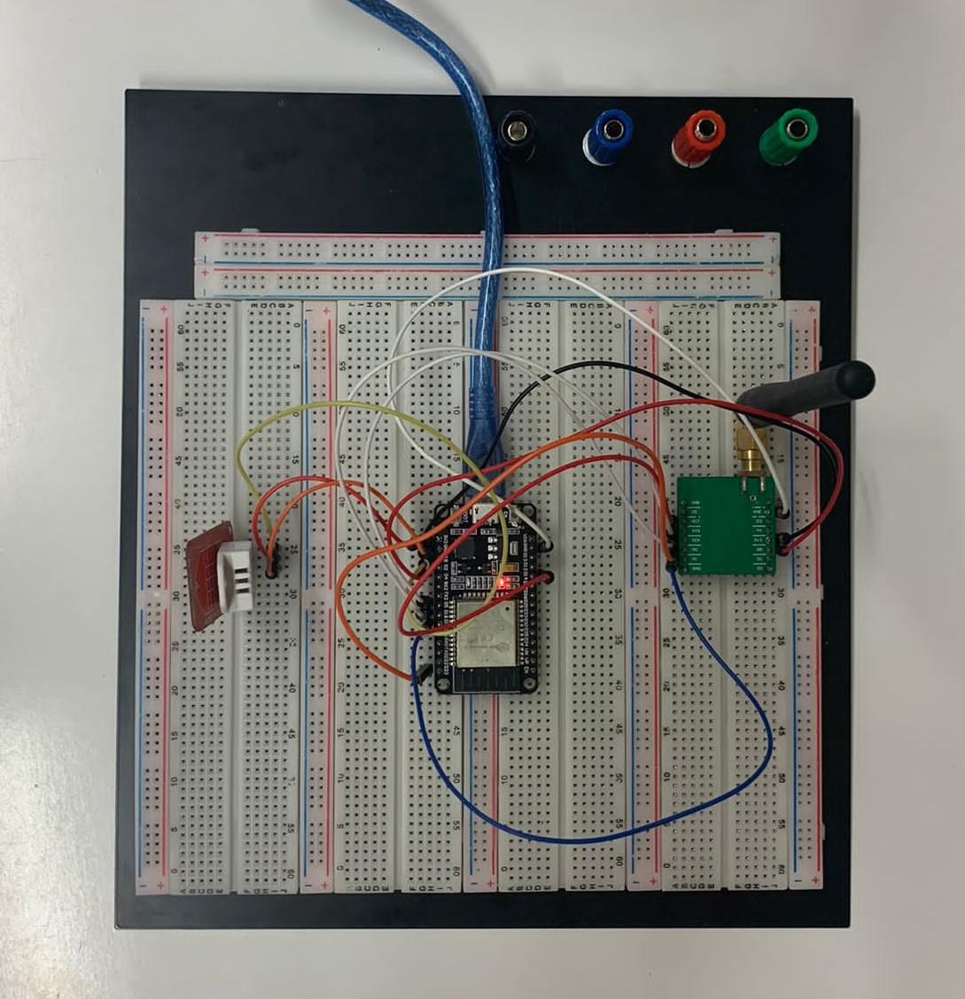

# LoRaDHT22


## Description

In this project we are going to make LoRa communication between 2 devices. in both circuits we are going to have an esp 32, the esp32 is a microcontroller wich is powered by a 3.3v continuous current. LoRa is a wireless data communication technology that uses a radio modulation technique that can be generated by Semtech LoRa transceiver chips. The transmitter will send the temperature and humidity measured by a dht22 sensor.

Transmitter:


More information is avaliable [here](About_this_project.pdf).

## How to use the code

> There are 2 programs: Receiver and Transmitter. 
> So the code has to be built and run on two different instances

Running with `VSCode`: 

* Clone the GitHub repository 
```sh
git clone https://github.com/Rick-1242/LoRaDHT22.git
```
* Go to your bash terminal, and change your current directory to the repository folder `<<Reciver || Trasmitter>>`
* After that, we can build this code. So, type in a bash terminal the :
```sh
platformio run
```
* If you want to test what happens if we program our board, type:
```sh
platformio run --target upload
```
* Finally, to show the message from the board, and confirm all steps are done well type the following:
```sh
platformio device monitor --port COM[3]
```
* In this case, PC and board are connected through COM3 port, but be careful and check it.

* Procced to compile and load the code


Alternatively, you can run the project with the `Arduino IDE`:
* Clone the GitHub repository 
```sh
git clone https://github.com/Rick-1242/LoRaDHT22.git
```
* Go to the `./LoRaDHT22/<<Reciver || Trasmitter>>/src` folder and open the `main.cpp` file with the IDE
* To install the ESP32 board in your Arduino IDE, follow these instructions:
    1. In your Arduino IDE, go to `File>Preferences`
    2. Enter the following into the “Additional Board Manager URLs” field: `https://raw.githubusercontent.com/espressif/arduino-esp32/gh-pages/package_esp32_index.json`
    3. Then, click the “OK” button     
    4. Open the Boards Manager. Go to `Tools>Board>Boards Manager…`
    5. Search for `ESP32` and press install button for the “ESP32 by Espressif Systems“:
    6. Select your Board in `Tools>Board` menu (in our case it’s the DOIT ESP32 DEVKIT V1)
    7. Select the correct COM Port
* Procced to compile and load the code

## Testing procedures

Make sure all the cables are connected according to the schematics.

Power the ESP32(draws: max 600mA, usually 200mA), to power your ESP32 dev kit, you have three options:
* Via the USB port.
* Using unregulated voltage between 5V and 12V, connected to the 5V and GND pins. This voltage is regulated onboard.
* Using regulated 3.3V voltage, connected to the 3.3V and GND pins. Be very careful with that: do not exceed the 3.3V limit, or your ESP32 module will be damaged.
  
On start up the serial monitor of both the Receiver and Transmitter displays if the tests were successful or if they have failed if the former is the case then proceed, otherwise fix the issue that has occurred and then try again.

At this point everything is working correctly and you can ensure the transmission of data by checking the packet counter(0.5 packets/second) and the RSSI values(it shouldn't go under -108dBm).

Don't forget to validate the values produced by the DHT22 with a separate measuring instrument.

## Requierments

* UseVSCode ? [PlatformIO](https://docs.platformio.org/en/latest/) : [ArduinoIDE](https://randomnerdtutorials.com/installing-the-esp32-board-in-arduino-ide-windows-instructions/)
* DOIT ESP32 DEVKIT V1(MCU)
* RFM95(LoRa Transceiver)
* SSD1306(Oled Dispaly)
* DHT22(Sensor)

## Authors

Ueberbacher Riccardo, Cheema Sahib Singh, Sebastiano Spada
